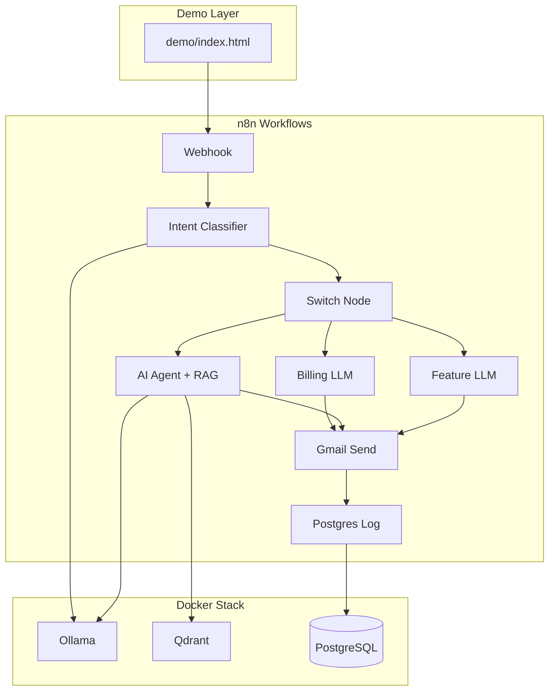

# Autonomous Support Agent with Vector Memory

An end-to-end **n8n** demonstration of agentic customer support: webhook intake, LLM intent routing, RAG-powered technical responses, Gmail delivery, and PostgreSQL audit logging — all running locally with **Ollama** and **Qdrant**.

## What This Demonstrates

- **Intent routing** — LLM classifies inquiries (Billing / Technical / Feature Request) and branches via Switch node
- **Agentic RAG** — AI Agent searches a vector knowledge base for technical **and billing** support answers
- **Multi-system orchestration** — n8n coordinates Ollama, Qdrant, Gmail, and PostgreSQL in one workflow
- **Production patterns** — validation, audit logging, HTML email, webhook auth, error paths

## Architecture



## Tech Stack

| Component | Role |
|-----------|------|
| [n8n](https://n8n.io/) | Workflow orchestration |
| [Ollama](https://ollama.com/) | Local LLM (`llama3.2`) + embeddings (`nomic-embed-text`) |
| [Qdrant](https://qdrant.tech/) | Vector store for RAG |
| [PostgreSQL](https://www.postgresql.org/) + pgvector | n8n persistence + interaction audit log |
| Gmail OAuth2 | Outbound email delivery |

## Quick Start

### 1. Clone and configure

```bash
cd "Autonomous Support Agent with Vector Memory"
cp .env.example .env
# Edit .env — set POSTGRES_PASSWORD and secrets
```

### 2. Start the stack

```bash
chmod +x scripts/*.sh
./scripts/setup.sh
```

First boot pulls Ollama models (~5–15 min on CPU). Monitor progress:

```bash
docker compose logs -f ollama-init
```

### 3. Configure n8n credentials

Open http://localhost:5678 and create/verify these credentials:

| Credential | Type | Settings |
|------------|------|----------|
| **Ollama Local** | Ollama | Base URL: `http://ollama:11434` |
| **Ollama OpenAI Compatible** | OpenAI | Base URL: `http://ollama:11434/v1`, API Key: `ollama` |
| **Qdrant Local** | Qdrant | URL: `http://qdrant:6333` |
| **Support Agent Postgres** | Postgres | Host: `postgres`, DB: `support_agent`, user/pass from `.env` |
| **Gmail OAuth2** | Gmail | See [docs/gmail-setup.md](docs/gmail-setup.md) |

Template credential files are in `n8n/credentials/` for reference.

### 4. Ingest the knowledge base

1. Open workflow **01 - KB Ingestion**
2. Assign credentials to **Qdrant Insert** and **Embeddings OpenAI (Ollama)**
3. Click **Execute Workflow**

Verify:

```bash
./scripts/trigger-ingestion.sh
```

### 5. Activate the support agent

1. Open workflow **02 - Support Agent**
2. Assign all credentials (Ollama, Qdrant, Embeddings, Postgres, Gmail)
3. **Activate** the workflow (toggle in top-right)
4. Copy the production webhook URL

### 6. Run the demo

Open `demo/index.html` in your browser. Update `demo/config.js` if your webhook URL differs.

Pre-warm before a live demo:

```bash
./scripts/prewarm-demo.sh
# or: make prewarm
```

Serve the demo form (avoids browser CORS issues with `file://`):

```bash
./scripts/serve-demo.sh
# Open http://localhost:8080/index.html
```

Verify the full stack:

```bash
./scripts/verify-stack.sh
# or: make verify
```

See [docs/demo-checklist.md](docs/demo-checklist.md) for a live demo runbook.
See [docs/credentials-setup.md](docs/credentials-setup.md) for credential wiring.


## Demo SQL Queries

```sql
-- Recent interactions
SELECT customer_email, intent, status, processing_ms, created_at
FROM support_interactions
ORDER BY created_at DESC
LIMIT 10;

-- Interactions by intent today
SELECT intent, COUNT(*) AS count
FROM support_interactions
WHERE created_at >= CURRENT_DATE
GROUP BY intent;

-- Average response time by intent
SELECT intent, ROUND(AVG(processing_ms)) AS avg_ms
FROM support_interactions
GROUP BY intent;

-- Technical inquiries with RAG sources
SELECT customer_email, subject, rag_sources, created_at
FROM support_interactions
WHERE intent = 'technical'
ORDER BY created_at DESC
LIMIT 5;
```

Connect to Postgres:

```bash
docker compose exec postgres psql -U support_agent -d support_agent
```

## Project Structure

```
├── docker-compose.yml       # n8n + Postgres + Qdrant + Ollama
├── db/init.sql              # support_interactions schema
├── knowledge-base/          # 15 mock support articles
├── workflows/
│   ├── 01-kb-ingestion.json
│   └── 02-support-agent.json
├── demo/
│   ├── index.html           # Live demo form
│   ├── config.js
│   └── sample-payloads.json
├── scripts/
│   ├── setup.sh
│   ├── trigger-ingestion.sh
│   └── prewarm-demo.sh
└── docs/
    └── gmail-setup.md
```

## Workflows

### 01 - KB Ingestion

Reads markdown from `/data/knowledge-base`, chunks text, embeds via Ollama (`nomic-embed-text`, 768 dimensions), inserts into Qdrant collection `support_kb`.

**Run once** after stack startup.

### 02 - Support Agent

| Stage | Nodes |
|-------|-------|
| Intake | Webhook → Normalize → Validate |
| Routing | Classify Intent (Ollama) → Parse (with confidence threshold) → Switch |
| Billing | **AI Agent** + Qdrant billing RAG tool |
| Technical | **AI Agent** + Qdrant technical RAG tool |
| Feature | LLM chain → format response |
| Unknown | Escalation template (low confidence or unclassified) |
| Delivery | Build Email → Gmail → Check Status → Postgres → Respond |

### 03 - Error Handler

Logs workflow failures to `support_interactions`. Link as the error workflow in **02 - Support Agent** settings.

## curl Examples

```bash
# Technical (triggers RAG agent)
curl -X POST http://localhost:5678/webhook/support-inquiry \
  -H 'Content-Type: application/json' \
  -H 'X-Webhook-Token: demo_webhook_token_change_me' \
  -d '{"customer_name":"Alex","customer_email":"you@gmail.com","subject":"API 401","message":"API returns 401 invalid_api_key with Bearer auth"}'
```

More examples in `demo/sample-payloads.json`.

## Mac: Native Ollama (Faster Demos)

For faster inference during live demos, run Ollama natively on macOS:

1. Install Ollama from https://ollama.com
2. `ollama pull llama3.2 && ollama pull nomic-embed-text`
3. In `.env`: `OLLAMA_HOST=host.docker.internal:11434`
4. Restart n8n: `docker compose --profile cpu up -d n8n`

## Troubleshooting

| Problem | Solution |
|---------|----------|
| Ollama models not ready | `docker compose logs ollama-init` — wait for pull to finish |
| Embedding errors / 400 | Use **Embeddings OpenAI** node (not Embeddings Ollama) with `dimensions: 768` |
| Empty RAG results | Run KB Ingestion workflow; verify `support_kb` collection in Qdrant |
| Webhook 404 | Activate workflow **02 - Support Agent** |
| Webhook 401 | Match `X-Webhook-Token` header to `WEBHOOK_AUTH_TOKEN` in `.env` |
| Gmail fails | Re-auth OAuth — see [docs/gmail-setup.md](docs/gmail-setup.md) |
| Slow responses on CPU | Run `./scripts/prewarm-demo.sh` before demo; use native Mac Ollama |
| File read denied | Ensure `N8N_RESTRICT_FILE_ACCESS_TO=/data/knowledge-base` is set |

## Production Hardening Notes

- Enable webhook authentication (`WEBHOOK_AUTH_TOKEN`)
- Add rate limiting (reverse proxy or n8n Wait node)
- Human-in-the-loop escalation for low-confidence intents
- PII retention policy on `support_interactions`
- Use managed Qdrant/Pinecone for production scale
- Replace Gmail with SendGrid/SES for transactional volume

## License

MIT — use freely for portfolio demos and client presentations.
